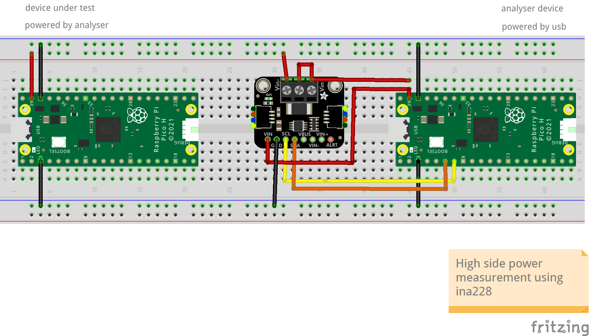

= Reading an INA228 power sensor via I2C

This example code shows how to interface the Raspberry Pi Pico with the INA228 current/voltage/power/temperature/energy/charge sensor. The sensor features a 20-bit ADC and supports up to 85V DC, making it a great choice for high precision measurements. It is capable of high-side and low-side measurements (which can be configured by soldering the jumper on the back of the board), but this example focuses on low-side measurements.

The sensor breakout board has an integrated 0.015 ohm, high precision shunt resistor, which is used for measuring voltage drop, which also gives current since the resistor value is known. This current, combined with the load voltage, allows load power and energy to be calculated. This example measures the power consumption of an LED.

[TIP]
======
The INA228 is highly configurable. Find the datasheet online (https://www.ti.com/lit/ds/symlink/ina228.pdf) to explore all of its capabilities beyond the simple example given here.
======

== Wiring information

[[ina228_i2c_wiring]]
[pdfwidth=75%]
.Wiring Diagram for INA228 sensor via I2C.

== List of Files

CMakeLists.txt:: CMake file to incorporate the example into the examples build tree.
ina228_i2c.c:: The example code.

== Bill of Materials

.A list of materials required for the example
[[ina228_i2c-bom-table]]
[cols=3]
|===
| *Item* | *Quantity* | Details
| Breadboard | 1 | generic part
| Raspberry Pi Pico or Pico 2 (any model) | 1 | https://www.raspberrypi.com/products/raspberry-pi-pico/
| INA228-based breakout board | 1 | https://www.adafruit.com/product/5832
| M/M Jumper wires | 8 | generic part
| LED | 1 | generic part
| 330 ohm resistor | 1 | generic part
|===
